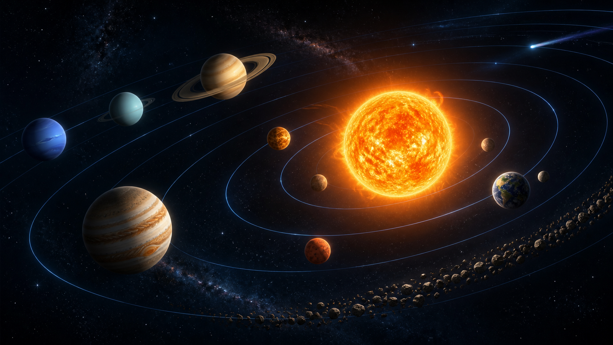

# Planets Sandbox

A browser-based gravity playground where you can build, alter, and explore planetary systems.



## Play locally

No installation or build step is required. Open `index.html` directly, or start a local server from the project folder:

```bash
python3 -m http.server 4173
```

Then visit `http://127.0.0.1:4173`.

## Features

- Pairwise N-body gravity: every planet, moon, star, and spawned object attracts every other body
- Solar System with eight planets, realistic planetary eccentricities, and 21 major moons (Mercury and Venus have no natural moons)
- Solar System, Earth and Moon, binary-star, and five-body-chaos presets
- Pause, resume, reset, clear, and time-speed controls
- Per-body gravity strength: select any planet, moon, star, or spawned object and change only that body's gravitational pull
- Merge, bounce, or pass-through collision behavior
- A New Planet launcher with asteroid, gas-giant, terrestrial, and hot-planet types
- Impact and orbit modes with a live system roster for choosing the target body
- Mouse-controlled orbit distance, prograde/retrograde motion, and adjustable eccentricity (“Accentuary”) with periapsis/apoapsis previews
- Hill-sphere stability and density-aware Roche-limit safeguards, plus physical tidal breakup into gravitating fragments
- Visible impact flashes, expanding shockwaves, rocky fragments, sparks, and gas clouds
- Scientific profiles for every body, including composition, atmosphere, temperature, density, magnetic-field strength, surface gravity, and escape velocity
- Editable mass, color, name, and velocity for selected bodies
- Camera panning, pointer-centered zooming, focus, and fit-to-system controls
- Fast pointer-centered manual zoom; creating an impact or orbit never moves or zooms the camera automatically
- Configurable trails, labels, grid, and velocity vectors
- Distinct procedural planet surfaces with Earth continents and clouds, Mars terrain and a thin atmosphere, Mercury craters, Venusian clouds, gas-giant bands, ice-giant storms, rings, and solar glow
- Responsive settings drawer for smaller screens
- Keyboard shortcuts available from the in-game help panel

## Controls

- Drag empty space to move the camera
- Scroll to zoom toward the pointer
- Click a body to select and edit it
- Double-click a body to focus it
- Press `A` to open the New Planet launcher
- Press `Space` to pause or resume
- Press `F` to fit the system in view
- Press `Esc` to cancel add-body mode

## Project files

- `index.html` — game interface and control panel
- `styles.css` — visual design and responsive layout
- `app.js` — simulation, rendering, camera, editing, and input logic
- `assets/solar-system-game-art.png` — original 1672 × 941 reference artwork used in the game header

## Visual asset

The included artwork features the Sun, eight major planets, orbital paths, an asteroid belt, stars, and a comet. The live simulation itself is rendered dynamically so every planet can move and interact.

## Simulation scope

The physics model is two-dimensional, so orbital inclination and three-dimensional axial tilt are not simulated. The built-in system includes the major moons used for gameplay rather than every known minor satellite. Close-orbit accuracy is prioritized automatically; at very high requested speeds the game slows simulated-time throughput instead of taking unstable oversized physics steps.
